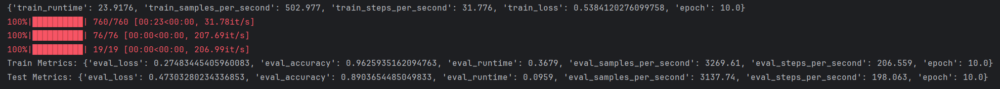
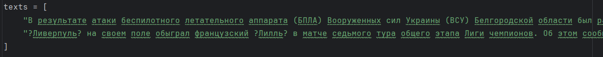
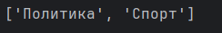

# README

After obtaining the news data set, we need to label the news according to our classification. Because this part of the work is too heavy, I borrowed AI to label it. The API provided by gigachat was used for labeling, and some corrections were made manually. The news types involving wars that AI could not handle were modified.After discussion, we adjusted the division of labor in the team.

The scope of work I was ultimately responsible for was: 1) Collecting news data. 2) Labeling news data categories. 3) Designing a classification model.

## 1.Collecting news data.

Before the mid-term, I had collected some data sets online, but these data were often from several years ago.

So I wrote a crawler to scrape news data from lenta.ru：TG\_bot\_for\_summarizing/get\_dataset  
/catch\_daily.py.

Its function is to find the news details page of the day according to the time. Then extract the description field from the news details page. Use regular expressions to find the "description" field. Save the news data to a CSV file.

In addition, crawlers can also be used to summarize and categorize news from websites

## 2.Labeling news data categories.

After obtaining the news data set, we need to label the news according to our classification. Because this part of the work is too heavy, I borrowed AI to label it. The API provided by gigachat was used for labeling, and some corrections were made manually. The news types involving wars that AI could not handle were modified.

## 3.Designing a classification model.

I also submit my model on hugging face: https://huggingface.co/dragonwingsLi/classification_model

In hugging face can see the weights

Use a pre-trained natural language processing model to classify Russian news data. By loading and fine-tuning a rubert-tiny2 model based on Hugging Face, we hope to be able to classify news text. The specific tasks include training the model, evaluating the performance, saving the best model, and using the model to make predictions on actual text.

1）Data preparation and preprocessing

• Use pandas's read\_csv function to load the data, deduplicate and sort the label column Ответ, and obtain all unique label values.  
• Next, generate a label2id dictionary to map text labels to numeric labels (IDs), and create an id2label dictionary based on the dictionary to map predicted numeric labels back to text labels.  
• Finally, use the label2id dictionary to convert the Ответ labels in the news data to numeric labels and store them in a new column label.

2）Dataset Partitioning

The dataset is divided into training and test sets with a ratio of 80% and 20%. To ensure the distribution of labels is consistent, the stratify parameter is used to keep the label ratio in the training and test sets consistent.

3）Model selection and loading

A pre-trained Russian sentiment classification model rubert-tiny2 was selected, which is a BERT-like model trained on a Russian corpus. In this project, I use AutoTokenizer and AutoModelForSequenceClassification to load the pre-trained model:  
• AutoTokenizer.from_pretrained(model_name) is used to load the tokenizer corresponding to the model.  
• AutoModelForSequenceClassification.from_pretrained(...) is used to load the pre-trained classification model and set parameters such as the number of labels and label mapping.

4）Data processing and coding

Before training, I need to tokenize the text data. By defining the tokenize\_function function, use the tokenizer to convert each news text into the model input format, including:  
• Truncate or pad each news text so that the maximum length of all inputs is consistent (set to 128).  
• Use Dataset.from\_pandas to convert the training set and test set to the Hugging Face Dataset format for further processing.  
• Use the map function to batch process the dataset so that each news is converted into the corresponding input ID, attention mask, and label.

5）Training and Evaluation

To train the model, I first defined the training parameters (TrainingArguments), including the number of training rounds, batch size, evaluation strategy, and saving strategy. Then I used the Trainer class to train:  
• The Trainer class encapsulates the model training process and provides training and evaluation interfaces.  
• During the training process, we set the evaluation strategy for each round and automatically save the best model based on the performance of the model on the validation set.  
After the model training is completed, we evaluate the training set and test set respectively, calculate and output the accuracy of the model. The trained model is saved in the specified directory for subsequent use.

6）Model saving and loading

After training is complete, the best model is saved in the ./best\_model directory. Use trainer.save\_model to save the model weights and tokenizer.save\_pretrained to save the corresponding tokenizer. This ensures that we load the same model and tokenizer in future predictions.

7）Prediction and practical application

After the model training is completed and saved, we use the saved model to predict the actual text. We first load the saved model and tokenizer, and then define the predict function:  
• The predict function receives the text input, converts it into the model input format through the tokenizer, makes predictions, and outputs the prediction results.  
• For each input text, the model outputs a predicted label ID, which we convert to label text through the id2label dictionary and print the prediction results.  
As an example, two news texts are used for prediction, and the model successfully classifies them into the corresponding news categories.

8）Results Analysis

The evaluation results on the test set show the accuracy of the model. By comparing the evaluation results of the training set and the test set, we can further analyze the performance of the model on different data and check whether there is overfitting or underfitting. In addition, the accuracy of the prediction results also provides an intuitive understanding of the actual effect of the model.

‍
